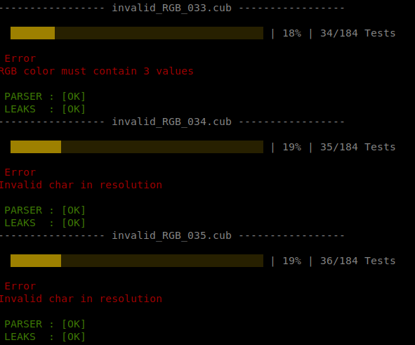
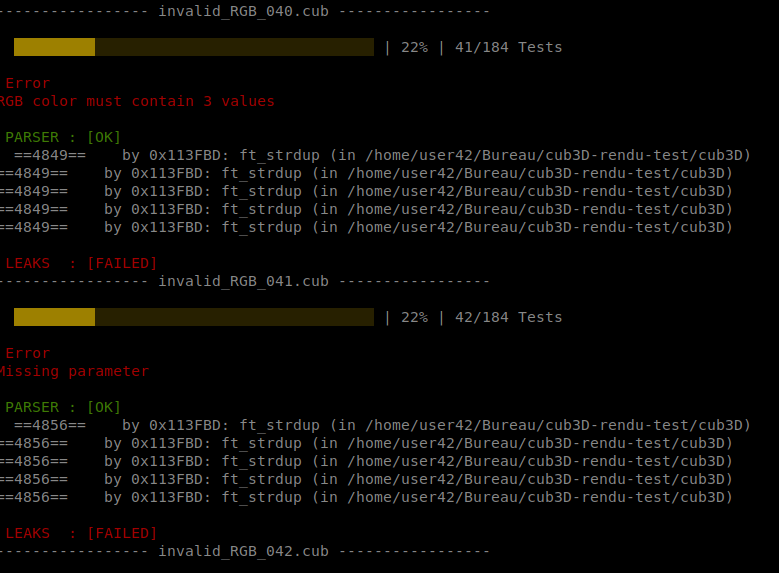
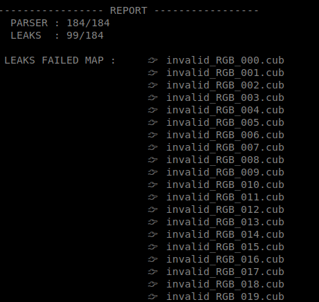

# cub3D tester

This tester aim to check your cub3d project against leaks and invalid maps with almost 200 tests.

## Requirements

- Have node installed (it's already installed in the vm provided by 42).
- Have valgrind installed (it's already installed in the vm provided by 42).
- Your executable should be named "cub3D". With a capital "D" just like it is stated in the subject.
- Your program has to print out "Error\n" after encountering a misconfiguration in the .cub file.

## Usage

1.	Go to the root of your cub3d directory and execute this command to clone the repo.
```
git clone https://github.com/mlaraki/cub3D_leaks_maps_tester.git
```
2.	cd into the cloned repo and and install dependencies (do it only once) :
```
cd cub3D_leaks_maps_tester && npm install
```
3.	Run the test
```
npm start
```
4.	if any leaks is encountered , a log file will be created in logs/ with the name of the failed map and the content of valgrind_log.

5.	You can add your own .cub files by add your maps to the folder "invalid_maps".


## Disclaimer

This tester is based on the cub3D subject available in the the subject directory.
Since 42 frequently update them, you should always check if it match the current subject.

## Screenshots



<br/>



<br/>



## Acknowledgment

Maps were taken from https://github.com/Dustin42Codam/cub3d_destroyer
